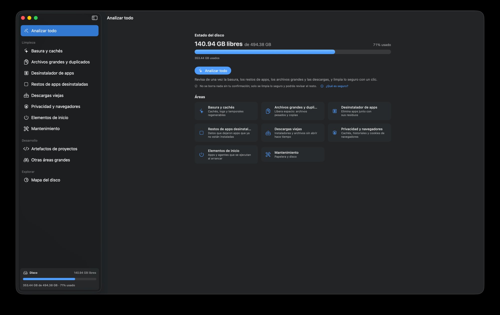

<h1 align="center">🧹 Soji (掃除)</h1>

  <b>Limpieza de disco para macOS — segura, reversible y transparente.</b> 
  App nativa en SwiftUI. <i>Soji</i> significa «limpieza» en japonés.

  
  
  
  

  

---

## ⬇️ Descargar

1. Descarga la última versión desde **[Releases](https://github.com/tavodev/soji-releases/releases/latest)**.
2. Descomprime y mueve **`Soji.app`** a tu carpeta **Aplicaciones**.
3. Ábrela. Al estar **firmada con Developer ID** y **notarizada por Apple**, abre sin avisos de Gatekeeper y, a partir de ahí, **se actualiza sola** (Sparkle).

> **Requisitos:** macOS 26 o superior.

---

## ✨ Qué hace

- **🧽 Libera espacio sin riesgo** — cachés, temporales, instaladores viejos, duplicados, descargas olvidadas y restos de apps desinstaladas.
- **🔍 Analizar todo (Smart Scan)** — revisa todas las áreas de una vez y limpia lo seguro con un clic.
- **🗺️ Mapa del disco (Space Lens)** — un *treemap* navegable para ver, de un vistazo, qué ocupa tu espacio.
- **🧰 Modo desarrollador** — artefactos de proyectos (`node_modules`, `target`, `.venv`, `Pods`…) y cachés de herramientas, sin tocar tu código ni tus configuraciones.
- **📊 Widget en la barra de menús** — espacio del disco y «Analizar todo» sin abrir la ventana.
- **🔄 Auto-actualización** — comprueba e instala nuevas versiones automáticamente.

---

## 🛡️ Seguro por diseño

Soji es **conservador por defecto**:

- Todo lo que borra va a la **Papelera** y es **reversible** (con **Deshacer**). El borrado permanente solo ocurre al vaciar la Papelera, con confirmación.
- Actúa **solo dentro de tu carpeta de usuario** (`~/`). **Nunca** toca archivos del sistema y **no pide contraseña de administrador**.
- **Nunca** toca el **Llavero**, **iCloud**, **Mail**, claves **SSH**, contraseñas ni marcadores del navegador.
- **Clic derecho** sobre cualquier resultado para **Vista rápida** o **Revelar en Finder** y verificarlo antes de borrar.

### Acceso total al disco

Para escanear cachés y residuos, macOS pide conceder permiso una vez:

1. **Ajustes del Sistema → Privacidad y seguridad → Acceso total al disco**.
2. Pulsa **+** y añade `Soji.app` desde *Aplicaciones*.
3. Vuelve a abrir Soji.

---

## 📝 Notas de versión

Consulta los cambios de cada versión en la pestaña **[Releases](https://github.com/tavodev/soji-releases/releases)**.

---

**Sobre este repositorio** — aloja únicamente los **artefactos públicos** (binarios firmados/notarizados y el *appcast* de Sparkle) que necesita el actualizador. El **código fuente de Soji es privado**. El `appcast.xml` lo gestiona `make release` desde el repo principal: no se edita a mano.

**Appcast:** <https://tavodev.github.io/soji-releases/appcast.xml>

